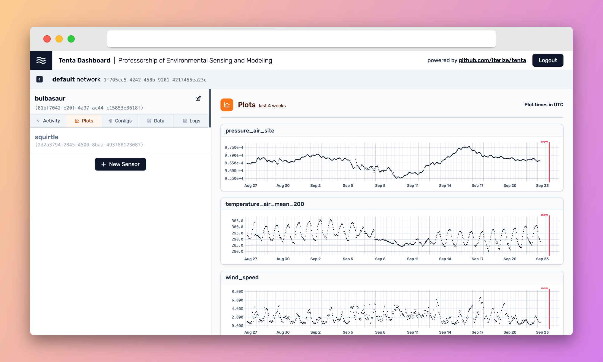

<!-- When you make changes here, remember to duplicate them to `docs/pages/index.mdx` -->

# Tenta



Tenta allows you to manage sensors remotely and in real-time:

- Collect and store measurements and logs from sensors
- Configure sensors remotely
- Monitor sensors in real-time with an intuitive dashboard

Tenta is lightweight and composable. It is designed to be used as a building block in your IoT stack, together with other awesome tools like [Grafana](https://grafana.com/), [DuckDB](https://duckdb.org/), or [polars](https://www.pola.rs/). Sensors connect to Tenta over a language-independent MQTT interface.

_Read the documentation at [tenta.onrender.com](https://tenta.onrender.com/)_

## Try it out!

You can try out Tenta in a few minutes with Docker Compose. Clone the repository and run:

```sh
NEXT_PUBLIC_BUILD_TIMESTAMP=$(date +%s) COMMIT_SHA=$(git rev-parse --verify HEAD) BRANCH_NAME=$(git branch --show-current) docker compose up --build
```

The dashboard will be available at [http://localhost:3000](http://localhost:3000). You can log in with the default username `happy-un1c0rn` and password `12345678`.

You can exit the application with `Ctrl+C` and remove the containers with:

```sh
docker compose down -v
```

## More

**Publication:** [](https://joss.theoj.org/papers/5daf8d2d13c01da24e949c20a08d29d0)

**License:** Tenta is licensed under the [MIT License](https://github.com/iterize/tenta/blob/main/LICENSE).

**Research:** We are open for collaborations! If you want to use Tenta in your research, don't hesitate to reach out to contact@iterize.dev. We are happy to help you get started and provide support.

**Contributing:** We are happy about contributions to Tenta! You can start by reading [our contribution guide](https://tenta.onrender.com/contribute).

**Versioning:** Tenta's MQTT, HTTP, and database interfaces adhere to Semantic Versioning. Changes will be tracked in release notes. Please expect breaking changes until we reach version 1.0.0.
